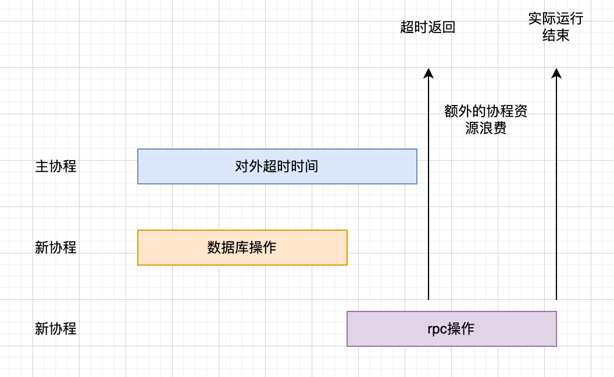
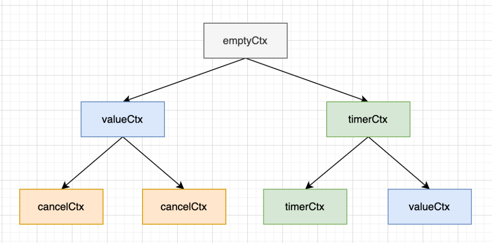
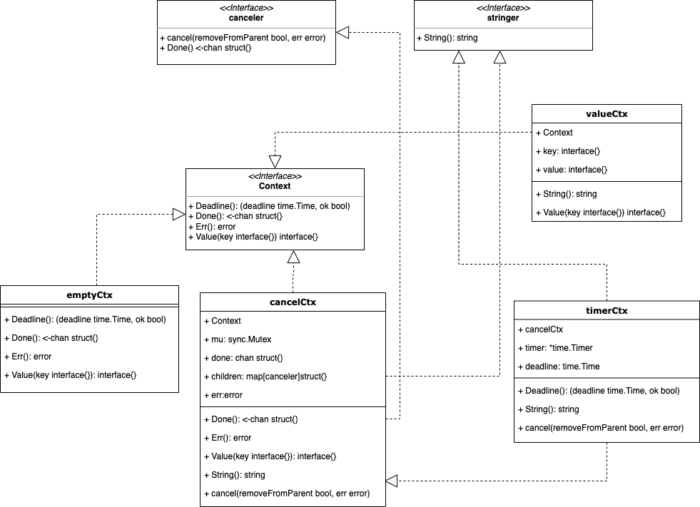
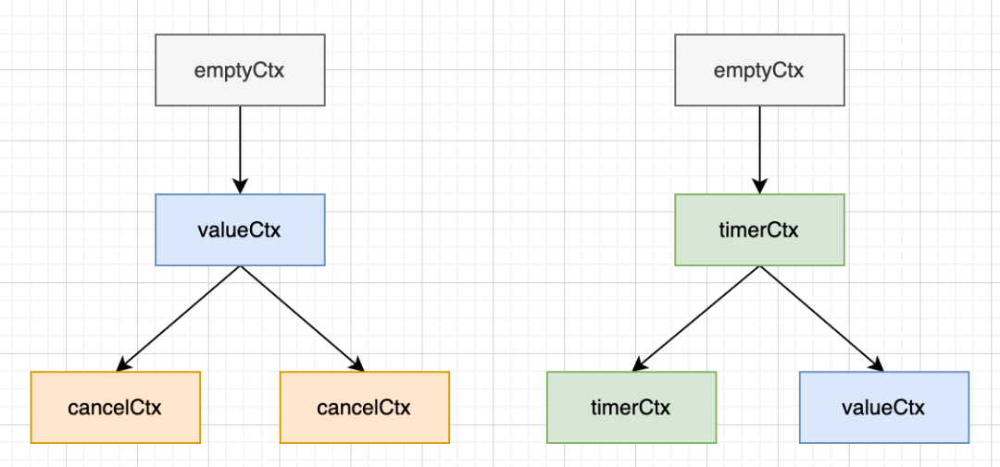
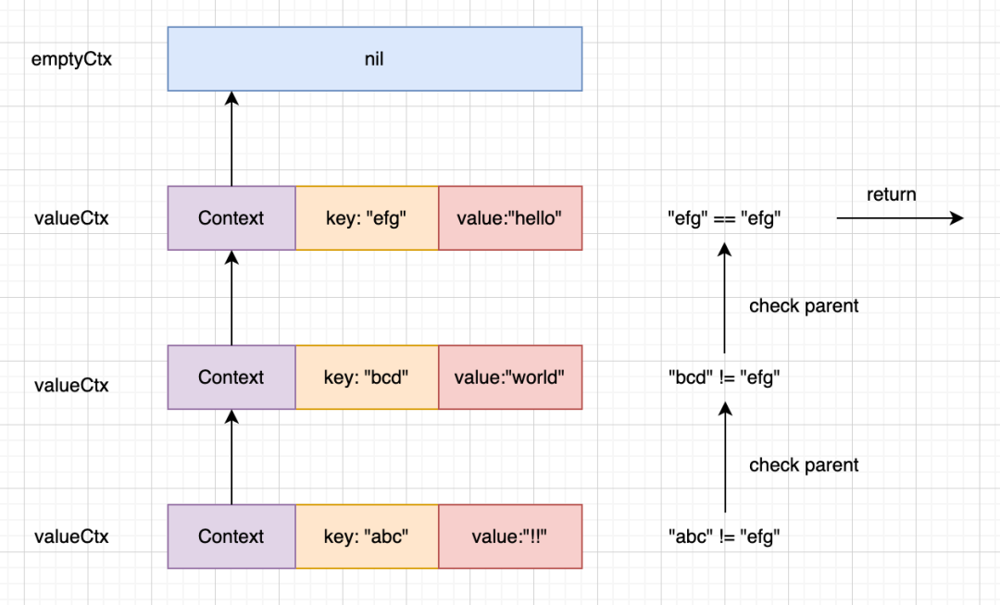
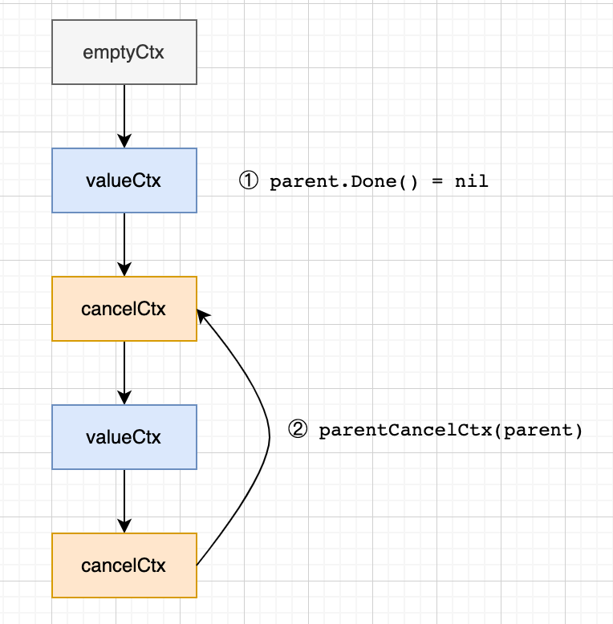

# context


## 一、为什么使用Context

### （1）go的扛把子

要论go最津津乐道的功能莫过于go强大而简洁的并发能力。

```go
func main() {
	go func() {
		fmt.Println("Hello World")
	}()
}
```

通过简单的go func(){}，go可以快速生成新的协程并运行。

### （2）想象一个没有Context的世界

go里面常用于协程间通信和管理的有channel和sync包。比如channel可以通知协程做特定操作（退出，阻塞等），sync可以加锁和同步。

假如我要实现一个可以同时关闭所有协程的程序，可以这样实现。

```go
package main

import (
	"fmt"
	"time"
)

func main() {
	closed := make(chan struct{})

	for i := 0; i < 2; i++ {
		// do something
		go func(i int) {
			select {
			case <-closed:
				fmt.Printf("%d Closed\n", i)
			}
		}(i)
	}

	// 发送指令关闭所有协程
	close(closed)

	time.Sleep(1 * time.Second)
}
```

因为go的协程不支持直接从外部退出，不像C++和Java有个线程ID可以操作。所以只能通过协程自己退出的方式。一般来说通过channel来控制是最方便的。

如果我想加点功能，比如到时间后退出，只要给channel增加关闭条件即可。

```go
package main

import (
	"fmt"
	"time"
)

func main() {
	closed := make(chan struct{})

	for i := 0; i < 2; i++ {
		go func(i int) {
			// do something
			select {
			case <-closed:
				fmt.Printf("%d Timeout\n", i)
			}
		}(i)
	}

	// 加个时间条件
	ta := time.After(5 * time.Second)

	select {
	case <-ta:
		close(closed)
	}

	time.Sleep(1 * time.Second)
}
```

### （3）用Context精简代码

上面的代码已经够简单了，但是还是显得有些复杂。比如每次都要在协程内部增加对channel的判断，也要在外部设置关闭条件。试想一下，如果程序要限制的是总时长，而不是单个操作的时长，这样每个操作要限制多少时间也是个难题。



这个时候就轮到Context登场了。Context顾名思义是协程的上下文，主要用于跟踪协程的状态，可以做一些简单的协程控制，也能记录一些协程信息。

下面试着用Context改造下前面的例子：

```go
package main

import (
	"context"
	"fmt"
	"time"
)

func main() {
	// 空的父context
	pctx := context.TODO()

	// 子context（携带有超时信息），cancel函数（可以主动触发取消）
	//ctx, cancel := context.WithTimeout(pctx, 5*time.Second)
	ctx, _ := context.WithTimeout(pctx, 5*time.Second)

	for i := 0; i < 2; i++ {
		go func(i int) {
			// do something

			// 大部分工具库内置了对ctx的判断，下面的部分几乎可以省略
			select {
			case <-ctx.Done():
				fmt.Printf("%d Done\n", i)
			}
		}(i)
	}

	// 调用cancel会直接关闭ctx.Done()返回的管道，不用等到超时
	//cancel()

	time.Sleep(6 * time.Second)
}
```

通过Context可以进一步简化控制代码，且更为友好的是，大多数go库，如http、各种db driver、grpc等都内置了对ctx.Done()的判断，我们只需要将ctx传入即可。

## 二、Context基础用法

接下来介绍Context的基础用法，最为重要的就是3个基础能力，**取消、超时、附加值**。

### （1）新建一个Context

```go
ctx := context.TODO()
ctx := context.Background()
```

这两个方法返回的内容是一样的，都是返回一个空的context，这个context一般用来做父context。

### （2）WithCancel

```go
// 函数声明
func WithCancel(parent Context) (ctx Context, cancel CancelFunc)
// 用法:返回一个子Context和主动取消函数
ctx, cancel := context.WithCancel(parentCtx)
```

这个函数相当重要，会根据传入的context生成一个子context和一个取消函数。当父context有相关取消操作，或者直接调用cancel函数的话，子context就会被取消。

举个日常业务中常用的例子：

```go
// 一般操作比较耗时或者涉及远程调用等，都会在输入参数里带上一个ctx，这也是公司代码规范里提倡的
func Do(ctx context.Context, ...) {
  ctx, cancel := context.WithCancel(parentCtx)
  
  // 实现某些业务逻辑
  
  // 当遇到某种条件，比如程序出错，就取消掉子Context，这样子Context绑定的协程也可以跟着退出
  if err != nil {
    cancel()
  }
}
```

### （3）WithTimeout

```go
// 函数声明
func WithTimeout(parent Context, timeout time.Duration) (Context, CancelFunc)
// 用法：返回一个子Context（会在一段时间后自动取消），主动取消函数
ctx := context.WithTimeout(parentCtx, 5*time.Second)
```

这个函数在日常工作中使用得非常多，简单来说就是给Context附加一个超时控制，当超时ctx.Done()返回的channel就能读取到值，协程可以通过这个方式来判断执行时间是否满足要求。

举个日常业务中常用的例子：

```go
// 一般操作比较耗时或者涉及远程调用等，都会在输入参数里带上一个ctx，这也是公司代码规范里提倡的
func Do(ctx context.Context, ...) {
  ctx, cancel := context.WithTimeout(parentCtx)
  
  // 实现某些业务逻辑

  for {
    select {
     // 轮询检测是否已经超时
      case <-ctx.Done():
        return
      // 有时也会附加一些错误判断
      case <-errCh:
        cancel()
      default:
    }
  }

}
```

现在大部分go库都实现了超时判断逻辑，我们只需要传入ctx就好。

### （4）WithDeadline

```go
// 函数声明
func WithDeadline(parent Context, d time.Time) (Context, CancelFunc)
// 用法：返回一个子Context（会在指定的时间自动取消），主动取消函数
ctx, cancel := context.WithDeadline(parentCtx, time.Now().Add(5*time.Second))
```

这个函数感觉用得比较少，和WithTimeout相比的话就是使用的是**截止时间**。

### （5）WithValue

```go
// 函数声明
func WithValue(parent Context, key, val interface{}) Context
// 用法: 传入父Context和(key, value)，相当于存一个kv
ctx := context.WithValue(parentCtx, "name", 123)
// 用法：将key对应的值取出
v := ctx.Value("name")
```

这个函数常用来保存一些链路追踪信息，比如API服务里会有来保存一些来源ip、请求参数等。

因为这个方法实在是太常用了，比如grpc-go里的metadata就使用这个方法将结构体存储在ctx里。

```go
func NewOutgoingContext(ctx context.Context, md MD) context.Context {
    return context.WithValue(ctx, mdOutgoingKey{}, rawMD{md: md})
}
```

## 三、Context源码实现

### （1）理解Context

- Context是一个接口

    虽然我们平时写代码时直接context.Context拿来就用，但实际上context.Context是一个接口，源码里是有多种不同的实现的，借此实现不同的功能。

    ```go
    type Context interface {
      // 返回这个ctx预期的结束时间
      Deadline() (deadline time.Time, ok bool)
      // 返回一个channel，当执行结束或者取消时被close，我们平时可以用这个来判断ctx绑定的协程是否该退出。实现里用的懒汉模式，所以一开始可能会返回nil
      Done() <-chan struct{}
      // 如果未完成，返回nil。已完成源码里目前就两种错误，已被取消或者已超时
      Err() error
      // 返回ctx绑定的key对应的value值
      Value(key interface{}) interface{}
    }
    ```

- Context们是一棵树

    context整体是一个树形结构，不同的ctx间可能是兄弟节点或者是父子节点的关系。

    同时由于Context接口有多种不同的实现，所以树的节点可能也是多种不同的ctx实现。总的来说我觉得Context的特点是：	

    - 树形结构，每次调用WithCancel, WithValue, WithTimeout, WithDeadline实际是为当前节点在追加子节点。
    - 继承性，某个节点被取消，其对应的子树也会全部被取消。
    - 多样性，节点存在不同的实现，故每个节点会附带不同的功能。

​		

- Context的果子们

    在源码里实际只有4种实现，要弄懂context的源码其实把这4种对应的实现学习一下就行，他们分别是：

    - emptyCtx：一个空的ctx，一般用于做根节点。

    - cancelCtx：核心，用来处理取消相关的操作。

    - timerCtx：用来处理超时相关操作。

    - valueCtx：附加值的实现方法。

    现在先简单对这几个实现有个概念，后面会对其中核心关键的部分讲解下。

    ### （2）Context类图

    

从类图中可以看出，源码里有4种结构和3种接口，相对于其他go库源码来说是比较简单的。

核心的接口是Context，里面包含了最常用的判断是否处理完成的Done()方法 。其他所有结构都通过①实现方法或②组合的方式来实现该接口。

核心的结构是cancelCtx，被timerCtx包含。cancelCtx和timerCtx可以说代表了Context库最核心的取消和超时相关的实现，也最为复杂些。

### （3）Context源码

因为篇幅关系，不会把每一行源码都拎出来，会挑比较重点的方法讲下。由于平时我们使用都是通过几个固定的方法入口，所以会围绕这几个方法讲下

#### emptyCtx

**对外体现**

```go
var (
   background = new(emptyCtx)
   todo       = new(emptyCtx)
)

func Background() Context {
   return background
}

func TODO() Context {
   return todo
}
```

TODO()，Background()其实都是返回一个emptyCtx。

**实现**

```go
type emptyCtx int

func (*emptyCtx) Deadline() (deadline time.Time, ok bool) {
   return
}
func (*emptyCtx) Done() <-chan struct{} {
   return nil
}
func (*emptyCtx) Err() error {
   return nil
}
func (*emptyCtx) Value(key interface{}) interface{} {
   return nil
}
func (e *emptyCtx) String() string {
   switch e {
   case background:
      return "context.Background"
   case todo:
      return "context.TODO"
   }
   return "unknown empty Context"
}
```

这个结构非常简单，都是返回nil。emptyCtx主要用于新建一个独立的树。比方说，我想在协程里做些异步操作，但是又想脱离主协程的ctx控制如使用独立的超时限制，就可以使用这种方式。但是在整个go程序里只有todo和background两个大根节点，所以TODO()和Background()其实是新建第二层级的子树。

```go
func demo(ctx context.Context){
  nctx := context.TODO()
  nctx := context.WithTimeout(nctx, 5*time.Second)
  ...
}
```



#### valueCtx

**对外体现**

```go
// 设置key, value值
func WithValue(parent Context, key, val interface{}) Context {
   if key == nil {
      panic("nil key")
   }
   if !reflectlite.TypeOf(key).Comparable() {
      panic("key is not comparable")
   }
   // 在当前节点下生成新的子节点
   return &valueCtx{parent, key, val}
}
// 根据key读取value
func (c *valueCtx) Value(key interface{}) interface{} {
   if c.key == key {
      return c.val
   }
   return c.Context.Value(key)
}
```

通过公共方法设置值，再通过valueCtx的内部方法获取值。后面再仔细讲下Value的实现方式。

**实现**

```go
type valueCtx struct {
   Context
   key, val interface{}
}
// 根据key读取value
func (c *valueCtx) Value(key interface{}) interface{} {
  // 每个ctx只绑定一个key，匹配则返回。否则向上追溯到匹配为止
   if c.key == key {
      return c.val
   }
   return c.Context.Value(key)
}
```

从实现上可以看出，每当我们往ctx里调WithValue塞值时，都会生成一个新的子节点。调用的次数多了，生成的子树就很庞大。 



若当前节点的key和传入的key不匹配会沿着继承关系向上递归查找。递归到根就变成nil，表示当前key在该子树序列里没存。

#### cancelCtx

介绍完上面两种比较简单的结构后，终于要来到复杂的cancelCtx。cancelCtx和timerCtx关联性很强，基本上弄懂一个，另外一个也差不多了。

**对外方法**

```go
func WithCancel(parent Context) (ctx Context, cancel CancelFunc) {
   // 新建一个cancelCtx
   c := newCancelCtx(parent)
   // 将父节点的取消函数和子节点关联，做到父节点取消，子节点也跟着取消
   propagateCancel(parent, &c)
   // 返回当前节点和主动取消函数（调用会将自身从父节点移除，并返回一个已取消错误）
   return &c, func() { c.cancel(true, Canceled) }
}
```

对外的方法里包含的几个方法都是重点的方法，后面主要讲下

**结构**

```go
type cancelCtx struct {
   Context

   mu       sync.Mutex            // protects following fields
   done     chan struct{}         // created lazily, closed by first cancel call
   children map[canceler]struct{} // set to nil by the first cancel call
   err      error                 // set to non-nil by the first cancel call
}
```

- done：用于判断是否完成。

- cancel：存子取消节点。

- err：取消时的错误，超时或主动取消。

```go
type canceler interface {
   cancel(removeFromParent bool, err error)
   Done() <-chan struct{}
}
```

这个接口约定了可以取消的context，比如cancelCtx和timerCtx是可以取消的，emptyCtx和valueCtx是不可以取消的。

**初始化**

```go
// newCancelCtx returns an initialized cancelCtx.
func newCancelCtx(parent Context) cancelCtx {
   return cancelCtx{Context: parent}
}
```

初始化就是将父节点设置了一下，其他不设置。

**cancelCtx的取消实现**

```go
// cancel closes c.done, cancels each of c's children, and, if
// removeFromParent is true, removes c from its parent's children.
func (c *cancelCtx) cancel(removeFromParent bool, err error) {
  // 取消无论是通过父节点还是自身主动取消，err都不为空
   if err == nil {
      panic("context: internal error: missing cancel error")
   }
   c.mu.Lock()
   if c.err != nil {
     // c.err 不为空表示已经被取消过，比如父节点取消时子节点可能已经主动调用过取消函数
      c.mu.Unlock()
      return // already canceled
   }
   c.err = err
   if c.done == nil {
     // closedchan 是一个已经关闭的channel，要特殊处理是因为c.done是懒加载的方式。只有调用c.Done()时才会实际创建
      c.done = closedchan
   } else {
      close(c.done)
   }
   // 递归取消子节点
   for child := range c.children {
      // NOTE: acquiring the child's lock while holding parent's lock.
      child.cancel(false, err)
   }
   c.children = nil
   c.mu.Unlock()

  // 从父节点中移除当前节点
   if removeFromParent {
      removeChild(c.Context, c)
   }
}
```

整个过程可以总结为：

- 前置判断，看是否为异常情况。

- 关闭c.done，这样外部调用cancelCtx.Done()就会有返回结果。

- 递归调用子节点的cancel方法。

- 视情况从父节点中移除子节点。

这里child.cancel(false，err)不从父节点移除子节点是因为当前节点操作已取过锁，移除操作会再取锁造成冲突，故先全部cancel后再将children置为nil一次性移除。

**propagateCancel 绑定父子节点的取消关系**

```go
// propagateCancel arranges for child to be canceled when parent is.
func propagateCancel(parent Context, child canceler) {
   done := parent.Done()
   if done == nil {
     // 若当前节点追溯到根没有cancelCtx或者timerCtx的话，表示当前节点的祖先没有可以取消的结构，后面的父子绑定的操作就可以不用做了，可参考下图
      return // parent is never canceled
   }

   select {
   case <-done:
     // 父节点已取消就直接取消子节点，无需移除是因为父子关系还没加到parent.children
      // parent is already canceled
      child.cancel(false, parent.Err())
      return
   default:
   }

  // 获取最近的可取消的祖先
   if p, ok := parentCancelCtx(parent); ok {
      p.mu.Lock()
      if p.err != nil {
      // 和前面一样，如果祖先节点已经取消过了，后面就没必要绑定，直接取消就好
         // parent has already been canceled
         child.cancel(false, p.err)
      } else {
        // 绑定父子关系
         if p.children == nil {
            p.children = make(map[canceler]struct{})
         }
         p.children[child] = struct{}{}
      }
      p.mu.Unlock()
   } else {
     // 当ctx是开发者自定义的并继承context.Context接口会进入这个分支，另起一个协程来监听取消动作，因为开发者自定义的习惯可能和源码中用c.done和c.err的判断方式有所不同
      atomic.AddInt32(&goroutines, +1)
      go func() {
         select {
         case <-parent.Done():
            child.cancel(false, parent.Err())
         case <-child.Done():
         }
      }()
   }
}
```



①当祖先继承链里没有cancelCtx或timerCtx等实现时，Done()方法总是返回nil，可以作为前置判断。

②parentCancelCtx取的是可以取消的最近祖先节点。

**总结**

总结一下，cancelCtx的作用其实就两个：

- 绑定父子节点，同步取消信号，父节点取消子节点也跟着取消。

- 提供主动取消函数。

#### timerCtx

**结构体**

```go
type timerCtx struct {
   cancelCtx
   timer *time.Timer // Under cancelCtx.mu.

   deadline time.Time
}
```

相比cancelCtx多了一个计时器和截止时间。

**取消方法**

```go
func (c *timerCtx) cancel(removeFromParent bool, err error) {
   c.cancelCtx.cancel(false, err)
   if removeFromParent {
      // Remove this timerCtx from its parent cancelCtx's children.
      removeChild(c.cancelCtx.Context, c)
   }
   c.mu.Lock()
   if c.timer != nil {
      c.timer.Stop()
      c.timer = nil
   }
   c.mu.Unlock()
}
```

取消方法就是直接调用cancelCtx的取消外加计时器停止。

**对外方法**

```go
func WithDeadline(parent Context, d time.Time) (Context, CancelFunc) {
   if cur, ok := parent.Deadline(); ok && cur.Before(d) {
     // 传入的截止时间在父节点截止时间之后，则父节点取消时会同步取消当前子节点，不需要额外再设置计费器了，可以当普通的cancelCtx对待。
      // The current deadline is already sooner than the new one.
      return WithCancel(parent)
   }
   c := &timerCtx{
      cancelCtx: newCancelCtx(parent),
      deadline:  d,
   }
   propagateCancel(parent, c)
   dur := time.Until(d)
   if dur <= 0 {
     // 已超时直接取消
      c.cancel(true, DeadlineExceeded) // deadline has already passed
      return c, func() { c.cancel(false, Canceled) }
   }
   c.mu.Lock()
   defer c.mu.Unlock()
   if c.err == nil {
     // 间隔时间到后主动触发取消
      c.timer = time.AfterFunc(dur, func() {
         c.cancel(true, DeadlineExceeded)
      })
   }
   return c, func() { c.cancel(true, Canceled) }
}
```

## 四、总结

综上所述，Context的主要功能就是用于控制协程退出和附加链路信息。核心实现的结构体有4个，最复杂的是cancelCtx，最常用的是cancelCtx和valueCtx。整体呈树状结构，父子节点间同步取消信号。

